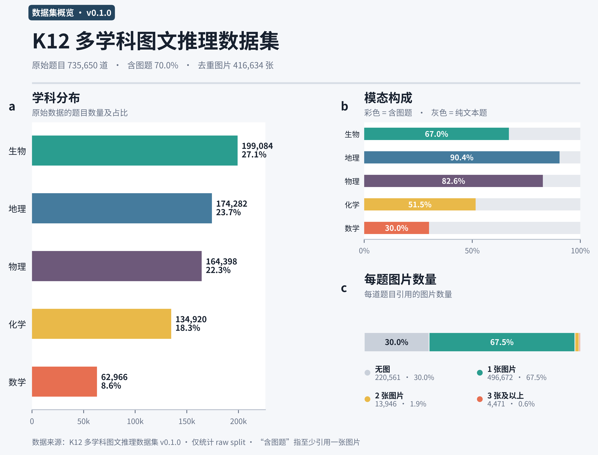

# K12 多学科图文推理数据集

本数据集面向中小学多学科图文推理任务，覆盖数学、物理、生物、地理和化学，数据形式同时包含纯文本题目与含图题目，可用于多模态理解、视觉信息抽取、学科知识推理以及答案生成等任务的研究与评测。

数据主要由三部分构成：公开开源数据经学科筛选、格式清洗和字段统一后形成的有效样本；从实体书题目图像或文档中抽取并清洗的自建 OCR 数据；以及基于 vLLM 构造的合成与改写数据。发布前已完成图片闭包检查、结构统一、规则化来源字段清理、精确重复题处理和冲突答案复核。

v0.1.0 共包含 736,701 条记录：`raw` 735,650 条，公开参考测试集 `test` 1,051 条。515,572 条记录包含图片，占 69.98%；共发布 416,634 张按内容寻址去重后的图片。测试集保留答案，不作为隐藏榜单。

完整数据已发布至 [Hugging Face](https://huggingface.co/datasets/zhenliuu/k12-multidisciplinary)。

## 数据统计

<p align="center">
  
</p>

<p align="center"><sub>图表仅统计 <code>raw</code> split；“含图”表示题目引用至少一张图片。统计版本：v0.1.0。</sub></p>


## 数据结构

| split | 记录数 | 用途 |
| --- | ---: | --- |
| `raw` | 735,650 | 整理后的原始题目数据 |
| `test` | 1,051 | 带答案的公开参考测试集 |

每条记录有 15 个顶层字段：`id`、`source_id`、`source_file`、`split`、`question_type`、`subject`、`language`、`question`、`options`、`answer`、`explanation`、`images`、`table`、`sub_questions` 和 `metadata`。完整约束见 [`release/v0.1.0/record.schema.json`](release/v0.1.0/record.schema.json)。

题目以 Zstandard 压缩的 Parquet 分片发布；图片保存在未二次压缩的 POSIX tar 分片中，并通过 `images/index.parquet` 建立图片路径、tar 分片、字节数和 SHA-256 的映射。各发布文件的哈希见 `SHA256SUMS.huggingface`。

## 加载

```python
from datasets import load_dataset

dataset = load_dataset("zhenliuu/k12-multidisciplinary")
sample = dataset["raw"][0]
print(sample["id"])
print(sample["subject"], sample["question_type"], sample["answer"])
print(sample["images"][0]["path"])
```

```text
k12_37ef67db045694272e0df54a6ea1ab26a40f0c092b8cc45ba11db7b9eee97a7d
math multiple_choice ['C']
images/5f/5fa6f571b1d65fafb7a04e2e422f74bbc4a7328381d05de8b205db1d6b10cc42.png
```

图片不内嵌在 Parquet 中。读取记录的 `images[].path` 后，先查询 HF 仓库里的 `images/index.parquet`，再从对应 tar 分片提取同名成员。

## 版本

当前发布版本为 `v0.1.0`。
